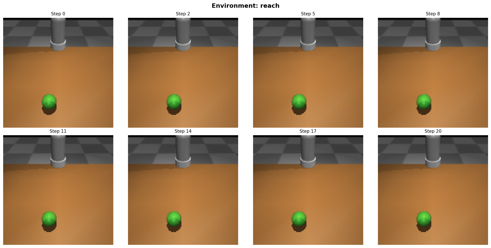
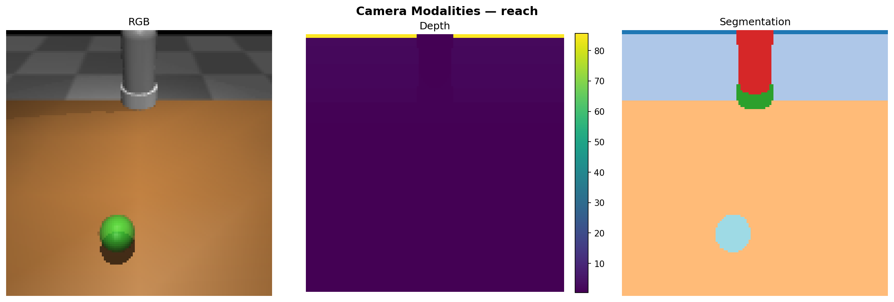
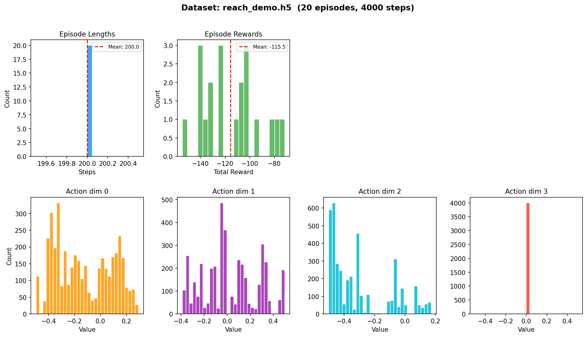
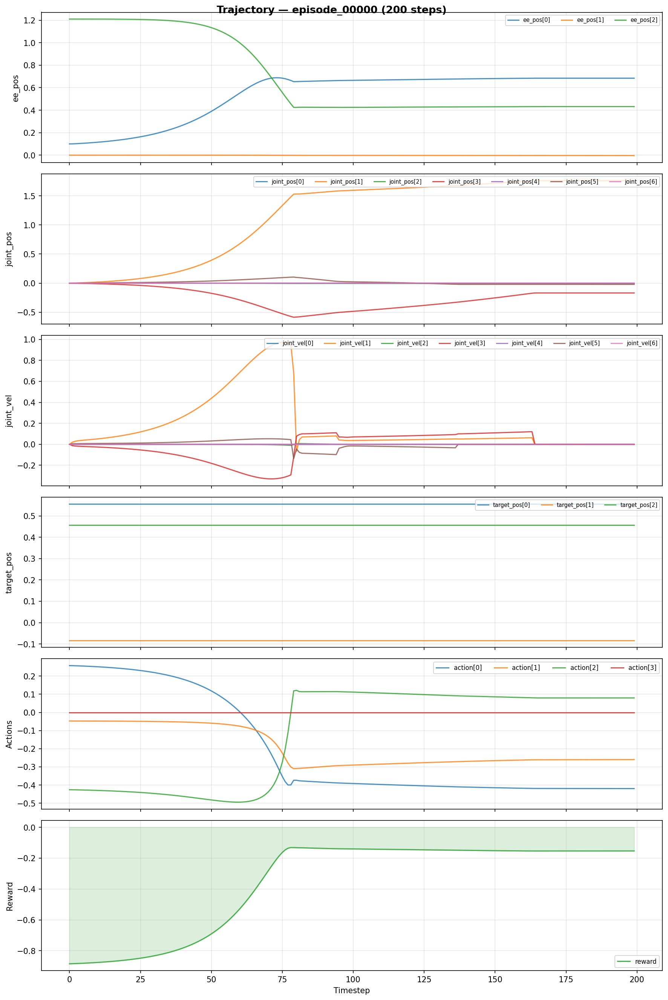
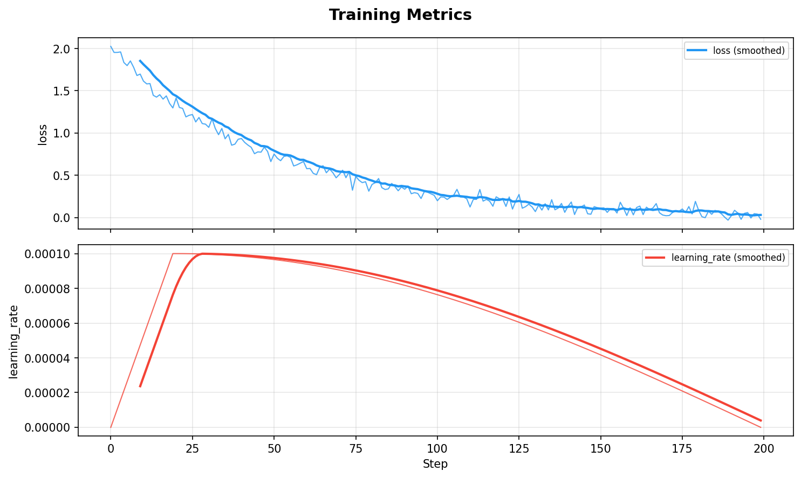
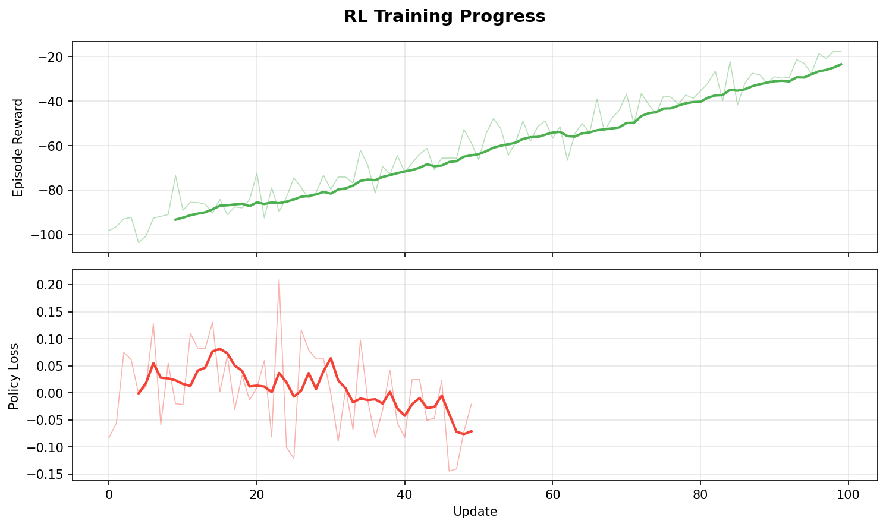

# SimScaleAI

**End-to-end robotics AI training and simulation platform** — from physics simulation to foundation model training, reinforcement learning, and deployment evaluation.

Built to demonstrate the full stack of robotic AI infrastructure: simulation environments, distributed training pipelines, foundation model architectures (VLM/VLA/BC), RL training, synthetic data generation, and experiment tooling.

## Architecture

```
┌──────────────────────────────────────────────────────────┐
│                     SimScaleAI CLI                       │
│            simscale train | eval | datagen | rl          │
├──────────────┬───────────────┬───────────────────────────┤
│  Simulation  │    Training   │       Models              │
│  (MuJoCo)    │  Infrastructure│  (BC, VLA, Diffusion)    │
│              │  (PyTorch DDP) │                          │
│  • Reach     │  • Distributed │  • Behavior Cloning      │
│  • PickPlace │  • AMP/FSDP   │  • Vision-Language-Action │
│  • Domain    │  • Checkpoint  │  • Diffusion Policy Head │
│    Randomize │  • WandB log  │  • Model Registry        │
├──────────────┼───────────────┼───────────────────────────┤
│      RL Pipeline             │   Synthetic Data Gen      │
│  • PPO Agent                 │  • Scene randomization    │
│  • GAE Advantages            │  • Multi-modal capture    │
│  • Closed-loop eval          │  • HDF5 export            │
│  • Reward function library   │  • Dataset statistics     │
└──────────────────────────────┴───────────────────────────┘
```

## Quick Start

### Installation

```bash
# Clone
git clone https://github.com/rk-edge/SimScaleAI.git
cd SimScaleAI

# Install (with all optional dependencies)
pip install -e ".[all]"

# Or minimal install
pip install -e .
```

### Try It Out

```bash
# List available environments and models
simscale list-envs
simscale list-models

# Generate synthetic training data
simscale datagen --env-name reach --n-episodes 100 --output data/reach.h5

# Train a Behavior Cloning model
simscale train --model bc --dataset data/reach.h5 --max-steps 1000

# Train a VLA model (with dummy data)
simscale train --model vla --max-steps 500

# Evaluate a checkpoint in simulation
simscale eval checkpoints/final.pt --env-name reach --n-episodes 20

# Train an RL agent (PPO)
simscale rl --env-name reach --total-steps 50000
```

### Python API

```python
from simscaleai.sim import make_env
from simscaleai.models import ModelRegistry
from simscaleai.rl.agents.ppo import PPOAgent

# Create simulation environment
env = make_env("reach", render_mode="human")
obs, info = env.reset()

# Step through the environment
action = env.action_space.sample()
obs, reward, terminated, truncated, info = env.step(action)

# Create a model
model = ModelRegistry.create("vla", image_size=128, action_dim=4)

# Train RL agent
agent = PPOAgent(obs_dim=20, action_dim=4)
agent.train(env)
```

## Project Structure

```
SimScaleAI/
├── simscaleai/
│   ├── sim/                    # Simulation environments
│   │   ├── base_env.py         # Abstract MuJoCo environment
│   │   ├── factory.py          # Environment registry & factory
│   │   ├── assets/             # MJCF robot/scene files (auto-generated)
│   │   └── envs/
│   │       ├── reach_env.py    # Reach task (move EE to target)
│   │       └── pick_place_env.py # Pick-and-place manipulation
│   ├── training/               # ML training infrastructure
│   │   ├── trainer.py          # Distributed training loop (DDP/AMP)
│   │   └── data/
│   │       └── dataset.py      # HDF5 trajectory datasets
│   ├── models/                 # Foundation model architectures
│   │   ├── registry.py         # Model registry (@register_model)
│   │   ├── bc.py               # Behavior Cloning (imitation learning)
│   │   ├── vla.py              # Vision-Language-Action model
│   │   └── policy_heads/
│   │       ├── mlp_head.py     # Standard MLP action head
│   │       └── diffusion_head.py # Diffusion Policy action head
│   ├── rl/                     # Reinforcement learning
│   │   ├── evaluator.py        # Closed-loop simulation evaluation
│   │   ├── agents/
│   │   │   └── ppo.py          # PPO with GAE
│   │   └── rewards/
│   │       └── rewards.py      # Composable reward functions
│   ├── datagen/                # Synthetic data generation
│   │   └── generator.py        # Dataset generation pipeline
│   └── tools/
│       └── cli.py              # Typer CLI entry point
├── tests/                      # Unit & integration tests
├── .github/workflows/ci.yml    # CI pipeline
├── pyproject.toml              # Package config & dependencies
└── README.md
```

## Visualization

SimScaleAI includes built-in visualization tools accessible via CLI and Python API. See [docs/visualization.md](docs/visualization.md) for the full guide.

### Simulation Environment Rendering

Grid view of a reach-task rollout with the Franka Panda arm:

```bash
simscale viz-env --env-name reach --n-steps 20 --save env_grid.png
```



### Camera Modalities

RGB, depth, and segmentation outputs from the wrist camera:

```bash
simscale viz-cameras --env-name reach --save cameras.png
```



### Dataset Statistics

Episode length, reward distributions, and per-dimension action histograms from an HDF5 dataset:

```bash
simscale viz-dataset data/reach.h5 --save dataset_stats.png
```



### Trajectory Timeline

Single episode breakdown — observations, actions, and rewards over time:

```bash
simscale viz-trajectory data/reach.h5 --episode 0 --save trajectory.png
```



### Training Metrics

Loss curves with smoothed overlays from BC/VLA training:



### RL Training Progress

PPO reward curves, episode lengths, and policy/value losses:



---

## Key Features

### 1. Physics Simulation (MuJoCo)
- Gymnasium-compatible environments for Franka Panda arm
- Reach and pick-and-place manipulation tasks
- Multi-camera rendering (RGB, depth, segmentation)
- Domain randomization (lighting, friction, object poses)
- Configurable via YAML — swap tasks without code changes

### 2. Distributed Training Infrastructure (PyTorch)
- PyTorch DDP for multi-GPU distributed training
- Mixed precision (AMP) with BFloat16/Float16
- Warmup + cosine decay learning rate schedule
- Checkpoint save/resume with full optimizer state
- WandB and TensorBoard logging
- Config-driven via Hydra-style system

### 3. Foundation Model Architectures
- **Behavior Cloning (BC)**: State and image-conditioned imitation learning
- **Vision-Language-Action (VLA)**: Transformer model that takes image + language → robot action (inspired by RT-2/OpenVLA)
- **Diffusion Policy Head**: Denoising diffusion for multi-modal action distributions
- **Model Registry**: Add new architectures with `@register_model("name")`

### 4. Reinforcement Learning
- PPO agent with Generalized Advantage Estimation (GAE)
- Closed-loop evaluation (model controls robot in real-time)
- Composable reward function library
- Vectorized environment support

### 5. Synthetic Data Generation
- Automated trajectory recording from simulation
- Domain randomization for diverse training data
- HDF5 export with compression
- Dataset statistics and validation

### 6. CLI Tooling
- `simscale train` — launch any training experiment
- `simscale eval` — closed-loop checkpoint evaluation
- `simscale datagen` — generate datasets at scale
- `simscale rl` — RL agent training
- `simscale list-envs` / `list-models` — discover components
- `simscale viz-env` / `viz-cameras` / `viz-dataset` / `viz-trajectory` / `viz-live` — visualization

## Configuration

All models have debug configs that run on CPU/MPS and full configs for GPU:

```python
# Debug (runs on your Mac)
model = ModelRegistry.create("vla",
    image_size=64, embed_dim=64, num_heads=2, num_layers=2
)

# Full scale (for cloud GPU)
model = ModelRegistry.create("vla",
    image_size=224, embed_dim=1024, num_heads=16, num_layers=24
)
```

## Running Tests

```bash
# All tests
pytest tests/ -v

# Skip slow tests
pytest tests/ -v -m "not slow"

# With coverage
pytest tests/ --cov=simscaleai --cov-report=term-missing
```

## Tech Stack

| Component | Technology |
|-----------|-----------|
| Physics Simulation | MuJoCo 3.x |
| ML Framework | PyTorch 2.x |
| Environment Interface | Gymnasium |
| Experiment Config | Hydra / OmegaConf |
| Logging | WandB / TensorBoard |
| Data Format | HDF5 (h5py) |
| CLI | Typer + Rich |
| Testing | pytest |
| Linting | Ruff |
| CI/CD | GitHub Actions |

## License

MIT
